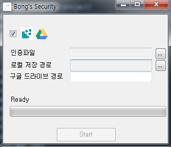
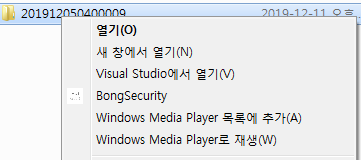

# BongSecurity

### Preview

### 아내님을 위한 첫번쨰 프로젝트

1. 원클릭으로 파일을 해당 폴더 또는 파일을 백업할 수 있는 기능을 만든다.

2. 백업은 두가지로 진행
    - GoogleDrive upload
    - Local drive
    
    
- 개발 로그 <https://github.com/holograming/BongSecurity/wiki>  

### Funtion TodoList  
- [o] GoogleDriveApi Enable   
- [o] GoogleDrive + .Net   
- [o] GoogleDrive api search/upload/create folder  
- [o] Local file copy/move
- [o] Compress file  
- [o] Progress with asynchrous  
- [o] add registry for context launch and icon
- [0] link to google drive api enable

